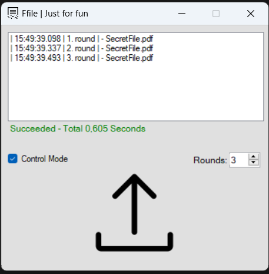

# Ffile
This project is a secure file deletion utility that encrypts and subsequently deletes given files. It is designed for the purpose of securely removing files containing sensitive data.

## Features:
- Customizable encryption rounds (Default is 3).
- File selection by clicking the file upload area or dragging and dropping files.
- If Control Mode is not enabled, operations proceed automatically. If Control Mode is active, user confirmation is required for each operation.

## Usage:

-  Open the project in a development environment that supports C# and WinForms.
-  Build and run the application.
- Set the desired number of encryption rounds (optional).
- Click the file upload area to select files or drag and drop files onto the area.
- If Control Mode is enabled, confirm each operation as prompted.

## Warning:
While this utility can be useful for some, it also comes with significant risks. Even if you are innocent, you could be charged with the crime of obstructing justice simply for using this program.